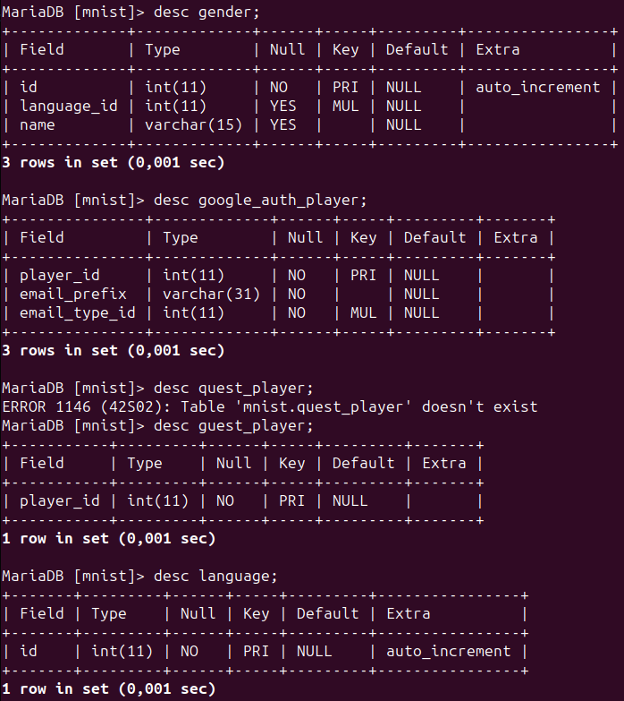

MariaDB [mnist]> show tables;

| Tables_in_mnist             |
|-----------------------------|
| ai_game                     |
| ai_game_answers             |
| ai_type                     |
| answer_answer_international |
| answer_option               |
| answer_type_international   |
| country                     |
| country_calling_code        |
| country_language            |
| country_name                |
| email_tld                   |
| email_type                  |
| gender                      |
| google_auth_player          |
| guest_player                |
| language                    |
| language_name               |
| login_info                  |
| password                    |
| phone_network               |
| picture                     |
| picture_answer_answer       |
| picture_answer_type         |
| picture_bin_fragments       |
| picture_ext_option          |
| picture_extension           |
| picture_last_fragment       |
| picture_real_answers        |
| picture_real_options        |
| picture_upload_info         |
| player_game                 |
| player_game_answer          |
| player_id                   |
| player_role                 |
| registered_player           |
| wordlist                    |
| wordlist_international      |
37 rows in set (0,001 sec)

MariaDB [mnist]> desc ai_game;

| Field      | Type      | Null | Key | Default             | Extra          |
|------------|-----------|------|-----|---------------------|----------------|
| id         | int(11)   | NO   | PRI | NULL                | auto_increment |
| ai_type_id | int(11)   | NO   | MUL | NULL                |                |
| beginning  | timestamp | YES  |     | current_timestamp() |                |
3 rows in set (0,001 sec)

MariaDB [mnist]> desc ai_game_answers;

| Field            | Type         | Null | Key | Default | Extra          |
|------------------|--------------|------|-----|---------|----------------|
| id               | int(11)      | NO   | PRI | NULL    | auto_increment |
| ai_game_id       | int(11)      | NO   | MUL | NULL    |                |
| picture_id       | int(11)      | NO   | MUL | NULL    |                |
| answer_option_id | int(11)      | NO   | MUL | NULL    |                |
| probability      | float(24,10) | NO   |     | NULL    |                |
5 rows in set (0,001 sec)

MariaDB [mnist]> desc ai_type;

| Field | Type        | Null | Key | Default | Extra          |
|-------|-------------|------|-----|---------|----------------|
| id    | int(11)     | NO   | PRI | NULL    | auto_increment |
| name  | varchar(31) | NO   |     | NULL    |                |
2 rows in set (0,001 sec)

MariaDB [mnist]> desc  answer_answer_international ;

| Field                    | Type         | Null | Key | Default | Extra          |
|--------------------------|--------------|------|-----|---------|----------------|
| id                       | int(11)      | NO   | PRI | NULL    | auto_increment |
| picture_answer_answer_id | int(11)      | NO   | MUL | NULL    |                |
| language_id              | int(11)      | NO   | MUL | NULL    |                |
| answer                   | varchar(255) | NO   | UNI | NULL    |                |
4 rows in set (0,001 sec)

MariaDB [mnist]> desc answer_option;

| Field                    | Type    | Null | Key | Default | Extra          |
|--------------------------|---------|------|-----|---------|----------------|
| id                       | int(11) | NO   | PRI | NULL    | auto_increment |
| picture_answer_type_id   | int(11) | NO   | MUL | NULL    |                |
| picture_answer_answer_id | int(11) | YES  | MUL | NULL    |                |
3 rows in set (0,001 sec)

MariaDB [mnist]> desc answer_type_international;

| Field                  | Type        | Null | Key | Default | Extra |
|------------------------|-------------|------|-----|---------|-------|
| id                     | int(11)     | NO   | PRI | NULL    |       |
| picture_answer_type_id | int(11)     | NO   | MUL | NULL    |       |
| language_id            | int(11)     | NO   | MUL | NULL    |       |
| answer                 | varchar(31) | NO   | UNI | NULL    |       |
4 rows in set (0,002 sec)

MariaDB [mnist]> desc country;

| Field | Type    | Null | Key | Default | Extra          |
|-------|---------|------|-----|---------|----------------|
| id    | int(11) | NO   | PRI | NULL    | auto_increment |
1 row in set (0,001 sec)

MariaDB [mnist]> desc country_calling_code;

| Field          | Type    | Null | Key | Default | Extra          |
|----------------|---------|------|-----|---------|----------------|
| id             | int(11) | NO   | PRI | NULL    | auto_increment |
| country_id     | int(11) | YES  | MUL | NULL    |                |
| country_number | int(11) | YES  | UNI | NULL    |                |
3 rows in set (0,001 sec)

MariaDB [mnist]> desc country_language;

| Field       | Type    | Null | Key | Default | Extra |
|-------------|---------|------|-----|---------|-------|
| country_id  | int(11) | NO   | PRI | NULL    |       |
| language_id | int(11) | NO   | PRI | NULL    |       |
2 rows in set (0,001 sec)

MariaDB [mnist]> desc country_name;

| Field       | Type        | Null | Key | Default | Extra |
|-------------|-------------|------|-----|---------|-------|
| country_id  | int(11)     | NO   | PRI | NULL    |       |
| language_id | int(11)     | NO   | PRI | NULL    |       |
| name        | varchar(63) | NO   |     | NULL    |       |
3 rows in set (0,001 sec)

MariaDB [mnist]> desc email_tld;

| Field | Type        | Null | Key | Default | Extra          |
|-------|-------------|------|-----|---------|----------------|
| id    | int(11)     | NO   | PRI | NULL    | auto_increment |
| tld   | varchar(15) | YES  | UNI | NULL    |                |
2 rows in set (0,001 sec)

MariaDB [mnist]> desc email_type;

| Field  | Type        | Null | Key | Default | Extra          |
|--------|-------------|------|-----|---------|----------------|
| id     | int(11)     | NO   | PRI | NULL    | auto_increment |
| domain | varchar(31) | NO   | MUL | NULL    |                |
| tld_id | int(11)     | NO   | MUL | NULL    |                |
3 rows in set (0,002 sec)

MariaDB [mnist]> desc gender;

| Field       | Type        | Null | Key | Default | Extra          |
|-------------|-------------|------|-----|---------|----------------|
| id          | int(11)     | NO   | PRI | NULL    | auto_increment |
| language_id | int(11)     | YES  | MUL | NULL    |                |
| name        | varchar(15) | YES  |     | NULL    |                |
3 rows in set (0,001 sec)

MariaDB [mnist]> desc google_auth_player;

| Field         | Type        | Null | Key | Default | Extra |
|---------------|-------------|------|-----|---------|-------|
| player_id     | int(11)     | NO   | PRI | NULL    |       |
| email_prefix  | varchar(31) | NO   |     | NULL    |       |
| email_type_id | int(11)     | NO   | MUL | NULL    |       |
3 rows in set (0,001 sec)

MariaDB [mnist]> desc quest_player;
ERROR 1146 (42S02): Table 'mnist.quest_player' doesn't exist

MariaDB [mnist]> desc guest_player;

| Field     | Type    | Null | Key | Default | Extra |
|-----------|---------|------|-----|---------|-------|
| player_id | int(11) | NO   | PRI | NULL    |       |
1 row in set (0,001 sec)

MariaDB [mnist]> desc language;

| Field | Type    | Null | Key | Default | Extra          |
|-------|---------|------|-----|---------|----------------|
| id    | int(11) | NO   | PRI | NULL    | auto_increment |
1 row in set (0,001 sec)

MariaDB [mnist]> desc language_name;

| Field            | Type        | Null | Key | Default | Extra |
|------------------|-------------|------|-----|---------|-------|
| language_id      | int(11)     | NO   | PRI | NULL    |       |
| name_language_id | int(11)     | NO   | PRI | NULL    |       |
| name             | varchar(31) | YES  |     | NULL    |       |
3 rows in set (0,001 sec)

MariaDB [mnist]> desc login_info;

| Field      | Type     | Null | Key | Default             | Extra          |
|------------|----------|------|-----|---------------------|----------------|
| id         | int(11)  | NO   | PRI | NULL                | auto_increment |
| player_id  | int(11)  | YES  | MUL | NULL                |                |
| country_id | int(11)  | YES  | MUL | NULL                |                |
| login_time | datetime | YES  | MUL | current_timestamp() |                |
4 rows in set (0,001 sec)

MariaDB [mnist]> desc password;

| Field         | Type        | Null | Key | Default             | Extra                         |
|---------------|-------------|------|-----|---------------------|-------------------------------|
| id            | int(11)     | NO   | PRI | NULL                | auto_increment                |
| player_id     | int(11)     | YES  | MUL | NULL                |                               |
| salt          | varchar(65) | YES  |     | NULL                |                               |
| password_hash | varchar(65) | YES  |     | NULL                |                               |
| created_at    | timestamp   | YES  |     | current_timestamp() | on update current_timestamp() |
5 rows in set (0,001 sec)

MariaDB [mnist]> desc phone_network;

| Field          | Type    | Null | Key | Default | Extra          |
|----------------|---------|------|-----|---------|----------------|
| id             | int(11) | NO   | PRI | NULL    | auto_increment |
| network_number | int(11) | YES  | UNI | NULL    |                |
2 rows in set (0,002 sec)

MariaDB [mnist]> desc picture;

| Field | Type    | Null | Key | Default | Extra          |
|-------|---------|------|-----|---------|----------------|
| id    | int(11) | NO   | PRI | NULL    | auto_increment |
1 row in set (0,001 sec)

MariaDB [mnist]> desc picture_answer_answer;

| Field | Type    | Null | Key | Default | Extra          |
|-------|---------|------|-----|---------|----------------|
| id    | int(11) | NO   | PRI | NULL    | auto_increment |
1 row in set (0,001 sec)

MariaDB [mnist]> desc picture_answer_type;

| Field | Type    | Null | Key | Default | Extra          |
|-------|---------|------|-----|---------|----------------|
| id    | int(11) | NO   | PRI | NULL    | auto_increment |
1 row in set (0,001 sec)

MariaDB [mnist]> desc picture_bin_fragments;

| Field           | Type        | Null | Key | Default | Extra |
|-----------------|-------------|------|-----|---------|-------|
| id              | bigint(20)  | NO   | PRI | NULL    |       |
| picture_id      | int(11)     | NO   | MUL | NULL    |       |
| fragment_bin    | binary(255) | NO   |     | NULL    |       |
| fragment_number | int(11)     | NO   |     | NULL    |       |
4 rows in set (0,001 sec)

MariaDB [mnist]> desc picture_ext_option;

| Field | Type       | Null | Key | Default | Extra          |
|-------|------------|------|-----|---------|----------------|
| id    | int(11)    | NO   | PRI | NULL    | auto_increment |
| name  | varchar(7) | YES  | UNI | NULL    |                |
2 rows in set (0,002 sec)

MariaDB [mnist]> desc picture_extension;

| Field         | Type    | Null | Key | Default | Extra |
|---------------|---------|------|-----|---------|-------|
| picture_id    | int(11) | NO   | PRI | NULL    |       |
| ext_option_id | int(11) | NO   | MUL | NULL    |       |
2 rows in set (0,001 sec)

MariaDB [mnist]> desc picture_last_fragment;

| Field       | Type       | Null | Key | Default | Extra |
|-------------|------------|------|-----|---------|-------|
| fragment_id | bigint(20) | NO   | PRI | NULL    |       |
| valid_bits  | int(11)    | NO   |     | NULL    |       |
2 rows in set (0,001 sec)

MariaDB [mnist]> desc picture_real_answers;

| Field                   | Type    | Null | Key | Default | Extra          |
|-------------------------|---------|------|-----|---------|----------------|
| id                      | int(11) | NO   | PRI | NULL    | auto_increment |
| picture_real_options_id | int(11) | NO   | MUL | NULL    |                |
2 rows in set (0,001 sec)

MariaDB [mnist]> desc picture_real_options;

| Field            | Type    | Null | Key | Default | Extra          |
|------------------|---------|------|-----|---------|----------------|
| id               | int(11) | NO   | PRI | NULL    | auto_increment |
| picture_id       | int(11) | NO   | MUL | NULL    |                |
| answer_option_id | int(11) | NO   | MUL | NULL    |                |
3 rows in set (0,001 sec)

MariaDB [mnist]> desc picture_upload_info;

| Field              | Type     | Null | Key | Default             | Extra          |
|--------------------|----------|------|-----|---------------------|----------------|
| id                 | int(11)  | NO   | PRI | NULL                | auto_increment |
| picture_id         | int(11)  | YES  | UNI | NULL                |                |
| uploaded_player_id | int(11)  | YES  | MUL | NULL                |                |
| upload_time        | datetime | YES  |     | current_timestamp() |                |
4 rows in set (0,001 sec)

MariaDB [mnist]> desc player_game;

| Field     | Type      | Null | Key | Default             | Extra          |
|-----------|-----------|------|-----|---------------------|----------------|
| id        | int(11)   | NO   | PRI | NULL                | auto_increment |
| player_id | int(11)   | NO   | MUL | NULL                |                |
| beginning | timestamp | YES  |     | current_timestamp() |                |
3 rows in set (0,001 sec)

MariaDB [mnist]> desc player_game_answer;

| Field            | Type    | Null | Key | Default | Extra          |
|------------------|---------|------|-----|---------|----------------|
| id               | int(11) | NO   | PRI | NULL    | auto_increment |
| player_game_id   | int(11) | NO   | MUL | NULL    |                |
| picture_id       | int(11) | NO   | MUL | NULL    |                |
| answer_option_id | int(11) | NO   | MUL | NULL    |                |
4 rows in set (0,001 sec)

MariaDB [mnist]> desc player_id;

| Field            | Type    | Null | Key | Default | Extra          |
|------------------|---------|------|-----|---------|----------------|
| id               | int(11) | NO   | PRI | NULL    | auto_increment |
| main_language_id | int(11) | NO   | MUL | 1       |                |
| player_role_id   | int(11) | NO   | MUL | 1       |                |
3 rows in set (0,001 sec)

MariaDB [mnist]> desc player_role;

| Field | Type         | Null | Key | Default | Extra |
|-------|--------------|------|-----|---------|-------|
| id    | int(11)      | NO   | PRI | NULL    |       |
| name  | varchar(255) | NO   |     | NULL    |       |
2 rows in set (0,001 sec)

MariaDB [mnist]> desc registered_player;

| Field                   | Type        | Null | Key | Default | Extra |
|-------------------------|-------------|------|-----|---------|-------|
| player_id               | int(11)     | NO   | PRI | NULL    |       |
| name                    | varchar(31) | NO   | UNI | NULL    |       |
| gender_id               | int(11)     | YES  | MUL | NULL    |       |
| email_prefix            | varchar(31) | YES  |     | NULL    |       |
| email_type_id           | int(11)     | YES  | MUL | NULL    |       |
| country_calling_code_id | int(11)     | YES  | MUL | NULL    |       |
| phone_network_id        | int(11)     | YES  | MUL | NULL    |       |
| phone                   | int(11)     | YES  |     | NULL    |       |
8 rows in set (0,001 sec)

MariaDB [mnist]> desc wordlist;

| Field | Type    | Null | Key | Default | Extra          |
|-------|---------|------|-----|---------|----------------|
| id    | int(11) | NO   | PRI | NULL    | auto_increment |
1 row in set (0,001 sec)

MariaDB [mnist]> desc wordlist_international;

| Field       | Type         | Null | Key | Default | Extra |
|-------------|--------------|------|-----|---------|-------|
| wordlist_id | int(11)      | NO   | PRI | NULL    |       |
| language_id | int(11)      | NO   | PRI | NULL    |       |
| word        | varchar(255) | NO   |     | NULL    |       |
3 rows in set (0,001 sec)
