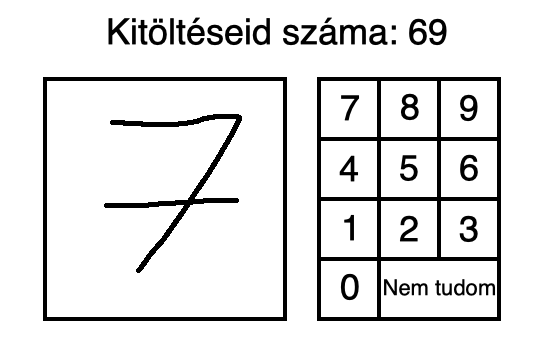
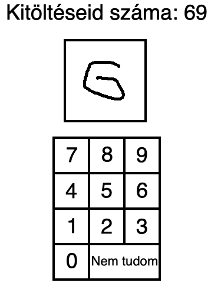
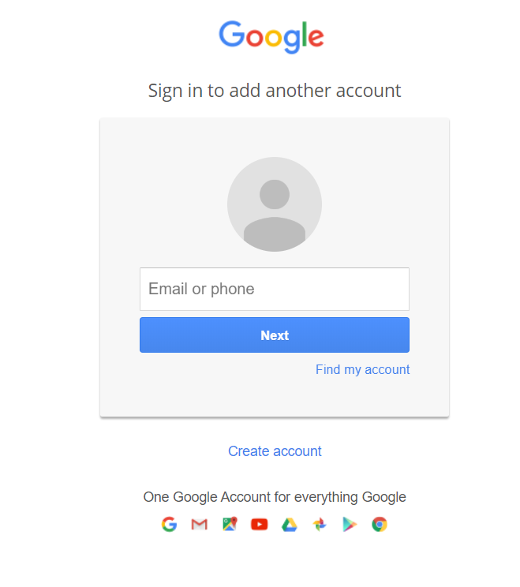

# Funkcionális specifikáció

## 1. Áttekintés

Egy kutatócsoport felkérte cégünket, hogy készítsünk nekik egy webalkalmazást, amit az egyik kutatásukhoz szeretnének használni.
Az a helyzet, hogy már vannak alkalmazások arra, hogy a mesterséges intelligencia felismerjen (írott vagy nem írott) 
számokat a képernyőn vagy fájlból beolvasva. Sajnos nincs olyan alkalmazás, ami az emberi oldalt vizsgálná meg, hogy az ember, 
hogy ismeri fel ezeket a számokat. A tesztkitöltők a hallgatók lennének, akik idő függvényében egy-egy előadás végén pár számról 
megmondanák, hogy szerintük mi az, de akár interneten keresztül másokat is elérhetnénk vele vagy akár más karokat is az egyetemen. 
Ez az adatgyűjtés és összehasonlítás szolgálna a mesterséges intelligencia fejlesztéséhez.

## 2. Jelenlegi helyzet

Az a helyzet, hogy szükség lenne egy adatbázisra, ami jól definiált táblákkal, kapcsolatokkal, attribútumokkal rendelkezik, és megfelel legalább a harmadik normál formulának. Fontos, hogy tartalmazza a modellt, a userek adatait, a számokat és minden mást úgy, hogy nincs benne redundancia, ha van, akkor a lekérdezések nem lesznek konzisztensek, és a fentebbi rétégek nem tudnak rá építkezni, ezért ennek tervezése rendkívül fontos feladat. Bár vannak kutatóink és tesztereink (hallgatóink), programozóink nincsenek a feladathoz. Nincs még kidolgozva a modell, ami alapján az AI és az ember válaszait össze tudnánk vetni.

## 3. Követelménylista

- Rendszergazda (admin) felület, ahol lehetőség van az alkalmazás adatainak módosítására:
  - Minták/Adatok feltöltése
  - Minták/Adatok törlése
  - Ranglista alaphelyzetbe állítása
- Bejelentkezési lehetőség:
  - Google, facebook, más
  - Vendégként játszás
  - IP-ből vagy más adatból meghatározása egy felhasználónak, ha nem akar bejelentkezni
- Egy ranglistához hasonló felület, ahol megtekinthető, hogy adott felhasználó hány tesztre adott (jó)választ.
- Jó adatfolyam
  - Képes legyen egyszerre több csomagot / képet küldeni a http kérések javításához
  - Képes legyen egyszerre több képre választ adni.
    - Előnye, hogy kevesebb a http kérés, a közölt adat és kisebb veszteség.    
- A felület reszponzív legyen
- A program weben legyen elérhető mindenki számára
- Elérhető legyen crossplatformon:
  - Linux (lehető legtöbb distro)
  - MacOS
  - Windows
  - Mobil (Android / iOS) 
- A felület intuitív, könnyen értelmezhető legyen
- Nyelvválasztás lehetősége (angol / magyar)
- Külső fenyegetettségek elől védett legyen a rendszer
- Ösztönözze a felhasználót a kitöltésre

## 4. Jelenlegi üzleti folyamatok modellje

- Rengeteg AI modell pl. OCR, amik képesek felismerni számokat (is)
- Adatbázis, tesztek és eredmények, amiket az AI már kitöltött.
    - (jelenleg nincs birtokunkban egy sem, de készíthető vagy lekérhető másoktól)
-  Hallgatók, akik csak arra várnak, hogy előadás végén részt vegyenek a projectben
    - (Köszönjük, Viktor)
-  Oktatók, akik ki tudják elemezni az eredményeket vagy új számokat bevinni
-  Diákok, akik kézírással mégtöbb adatot tudnak nekünk generálni
-  AI - fejlesztők, akik felhasználva az adatokat tudnak tovább kutatni

## 5. Igényelt üzleti folyamatok modellje

- Képek összegyűjtése a MariaDB adatbázishoz
    - Adatbázis megtervezése
        - Táblák és kapcsolatok implementálása
        - Egyéb megszorítások és követelmények implementálása
        - Adatok feltöltése a modellhez
    - Felhasználói játékok összegyűjtése és elemzése az adatbázishoz
    - AI általi válaszok hozzáadása az összehasonlításhoz
    - Adatok feldolgozása, játékok elemzése
    - Olyan képet ne mutasson sokat, amire a válasz egyértelmű
        - Helyezze előnybe azokat a képeket, amikre sok a "rossz" válasz
        - Ne használjuk az emberi erőforrásokat feleslegesen "könnyű" képekkel
    - A képek helyes letárolása az adatbázisban, hogy gyors maradjon

## 6. Használati esetek

- Elérhető legyen magyar, illetve angol nyelven, a következő platformokon:
  - Linux (lehető legtöbb distro)
  - MacOS
  - Windows
  - Mobil (Android / iOS)
  - Samsung okoshűtő
    - A felhasználó sörözés közben is tudja használni a programot
    - Olyanok is tudják használni, akik a konyhában laknak
      - Remek lehetőség a teljesítmény mérésére:
        - Sör előtt
        - Sör után
- Rendszergazdaként lehessen:
  - Mintákat/Adatokat feltölteni
  - Mintákat/Adatokat törölni
  - Ranglista alaphelyzetbe állítása
- Megtekinthető legyen a ranglista.

## 7. Képernyő tervek

### 7.1. Számítógépes megjelenés

### 7.2. Mobilos megjelenés

### 7.3. Bejelentkezési felület

## 8. Forgatókönyv

1. A felhasználó bejelentkezik
   - Lehet vendég is vagy a saját ip címéből készítünk neki profilt
   - Lehetőleg felhasználónév-jelszó párossal vagy más külső accounttal, pl.: Google
2. Tudjon játékot indítani
   - Kapjon kérdéseket, amikre válaszokat tud adni
   - Tudjon küldeni választ felhasználói interakcióval, http kérésekkel
   - Tudja meg esetlegesen, hogy "helyesen" válaszolt-e
   - A játék megszakítása ne jelentse az adatbázisban a sérülést
3. Kapjon értékelést a teljesítményéről, motiválja további játékra
4. Jelentkezzen ki, ha szükséges vagy zárja be az oldalt

- Egy esetleges admin vagy oktató tudjon új képeket feltölteni
- Egy AI specialista tudja összevetni az eredményeket
- Egy adatbázis szakértő api-kon keresztül szolgáltasson adatokat

## 9. Funkció - követelmény megfeleltetés

- Az elkészült program a megrendelő minden igényét kielégíti.
- Copyright: A felhasznált forrásokat, pl. a képek eredetét fel kell tüntetni.
- GDPR: A felhasználók adatainak gyűjtése illetve továbbítása a megfelelő tájékoztatás hiányában tilos.

## 10. Fogalomszótár

### 10.1. AI

Mesterséges Intelligencia:
- Mesterséges intelligenciának (MI vagy AI – az angol artificial intelligence-ből) egy gép, program vagy mesterségesen létrehozott 
tudat által megnyilvánuló intelligenciát nevezzük. A fogalmat legtöbbször a számítógépekkel társítjuk. A köznyelvben több külön 
jelentésben használják:
  - A mesterségesen létrehozott tárgy állandó emberi beavatkozás nélkül képes legyen válaszolni környezeti behatásokra 
  (automatizáltság) – az egyszerű szoftverágens ilyen;
  - A mesterségesen létrehozott tárgy képes legyen hasonlóan viselkedni, mint egy természetes intelligenciával rendelkező élőlény, 
  még ha az azonos viselkedés mögött eltérő mechanizmus is húzódik meg (TI szimuláltság – ilyen értelemben beszélhetünk pl. a számítógépes
  játékok gép irányította karaktereinek „intelligenciájáról”);
  - Végül, a mesterségesen létrehozott tárgy képes legyen viselkedését célszerűen és megismételhető módon változtatni
  (tanulás) – ez utóbbi jelentés az, ami a modern MI-kutatásban előtérbe került, és jelenleg az MI fogalmával legjobban azonosítható.

### 10.2. OCR

Szöveg felismerésére "szakosodott" AI. Ezekkel szokták pl.: a dokumentumokat PDF formátumba alakítani, bescannelni.

### 10.3. MNIST (Módosított Nemzeti Szabványügyi és Technológiai Intézet, angolul: Modified National Institute of Standards and Technology)

Egy nagy adatbázis kézzel írt számjegyekből, amelyet általában különféle képfeldolgozó rendszerek betanítására használnak.
Az adatbázist széles körben használják képzésre és tesztelésre is a gépi tanulás területén.

### 10.4. MVC modell

- Modell - View - Controller lényege, hogy a grafikus felülettől független környezetet tudunk kialakítani:
- Összetett, sok adatot a felhasználó elé táró számítógépes alkalmazásokban gyakori fejlesztői kívánalom az adathoz (modell) és a felhasználói felülethez (nézet) tartozó dolgok szétválasztása, hogy a felhasználói felület ne befolyásolja az adatkezelést, és az adatok átszervezhetők legyenek a felhasználói felület változtatása nélkül. A modell-nézet-vezérlő ezt úgy éri el, hogy elkülöníti az adatok elérését és az üzleti logikát az adatok megjelenítésétől és a felhasználói interakciótól egy közbülső összetevő, a vezérlő bevezetésével.
  - Az adatbázis tud kommunikálni a szerverrel, önállóan
  - A szerver tud adatot küldeni a kliensnek és kinyerni adatokat az adatbázisból API-kon keresztül
  - A kliens vagy a View modell csak egy megjelenítő, a felhasználó interakciókat továbbítja a modellnek, általában http protokolokon keresztül
