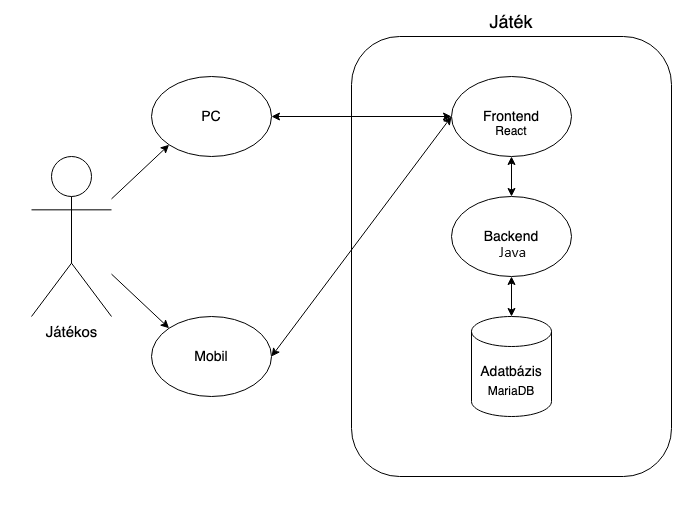

# Rendszerterv

## 1. Rendszer célja

Egy kutatócsoport felkérte cégünket, hogy készítsünk nekik egy webalkalmazást, amit az egyik kutatásukhoz szeretnének használni.
Az a helyzet, hogy már vannak alkalmazások arra, hogy a mesterséges intelligencia felismerjen (írott vagy nem írott) számokat a
képernyőn vagy fájlból beolvasva. Sajnos nincs olyan alkalmazás, ami az emberi oldalt vizsgálná meg, hogy az ember, hogy ismeri
fel ezeket a számokat. A tesztkitöltők a hallgatók lennének, akik idő függvényében egy-egy előadás végén pár számról megmondanák,
hogy szerintük mi az, de akár interneten keresztül másokat is elérhetnénk vele vagy akár más karokat is az egyetemen.
Ez az adatgyűjtés és összehasonlítás szolgálna a mesterséges intelligencia fejlesztéséhez.

A szoftver - mivel böngészőben lehet majd játszani - megnyitható lesz bármely olyan okos eszközön, amely támogatja a legfrissebb
számítógépes, illetve telefonos operációs rendszereket (pl. Windows 10 és frissebb, Android 8.0 vagy iOS 10 és frissebbek) és
böngészőket (pl. Google Chrome v100 és frissebb).

## 2. Projekt terv

**Projekt lebonyolítása:**

- A projekt kódolására 5 hetet fogunk fordítani
    - Az agilis fejlesztés biztosítása érdekében a 3. héten egy meetingen bemutatjuk a projektünk béta verzióját a megrendelőnek, és a maradék időben próbáljuk a megrendelői igényekhez igazodni.
- Az adatbázis megtervezése és kivitelezése, adatok feltöltése az adatbázisba *@egyiptomi425* feladata lesz.
- Az adatok kikeresése *@veresviktor02* feladata lesz.
- Az ábrák és diagramok rajzolása *@egyiptomi425* és *@veresviktor02* feladata.
- A frontend kódot *@veresviktor02* és *@pkristof1999* írja.
- A backend kódot *@veresviktor02*, *@pkristof1999* és *@egyiptomi425* írja.
- A teszteket a frontendhez *@veresviktor02* és *@pkristof1999* írja.
- A teszteket a backendhez *@egyiptomi425* írja.
- A manuális tesztelést *@veresviktor02*, *@pkristof1999* és *@egyiptomi425* csinálja.

## 3. Üzleti folyamatok modellje

### 3.1. Cél
A rendszer célja, hogy a felhasználók képfelismerési teszteket végezzenek el, majd ez az adatgyűjtés és összehasonlítás szolgálna a mesterséges intelligencia fejlesztéséhez. Minél több ilyen teszteset van - ahol lehetőleg a felhasználó minél pontosabban válaszol - annál jobban lehet tanítani a mesterséges intelligenciát.

### 3.2. Résztvevők

- Felhasználók: A játékban résztvevő játékos.
- Admin: A játék adatait módosítani képes felhasználó (pl. tesztadatok feltöltése, vagy törlése)

### 3.3. Játék menete

1. A felhasználó bejelentkezik
  - Lehet vendég is vagy a saját IP címéből készítünk neki profilt
  - Lehetőleg felhasználónév-jelszó párossal vagy más külső accounttal, pl.: Google, Facebook
2. Tudjon játékot indítani
  - Kapjon kérdéseket, amikre válaszokat tud adni
  - Tudjon küldeni választ felhasználói interakcióval, http kérésekkel
  - Tudja meg esetlegesen, hogy "helyesen" válaszolt-e
  - A játék megszakítása ne jelentse az adatbázisban sérülést
3. Kapjon értékelést a teljesítményéről, motiválja további játékra
4. Jelentkezzen ki, ha szükséges vagy zárja be az oldalt

- Egy esetleges admin vagy oktató tudjon új képeket feltölteni
- Egy AI specialista tudja összevetni az eredményeket
- Egy adatbázis szakértő API-kon keresztül szolgáltasson adatokat

### 3.4. Komponensek

- Frontend: A felhasználói felület.
- Backend: A szerveroldal, amely kapcsolatot tart a frontenddel és kezeli az üzleti logikát.
- Adatbázis: Az adatok tárolására és lekérdezésére szolgál.

## 4. Követelmények

### 4.1. Webes felület (responsive webdesign)

- Frameworkök
  - REACT + HTML - javascript frontend
  - Spring Boot - java backend
  - MariaDB - adatbázis, SQL a játékhoz
- Felhasználói felület
- Admin felület
- Toplista
- Biztonság
  - Adatkezelés és GDPR kérdések
  - A szerver védve legyen a támadásoktól
  - A játékos ne tudjon csalni
    - Ne tudja manipulálni az adatbázist és a kérdéseket
  - A rendszer naplózásának / adatbázisának kell tudni, hogy:
    - A játékos nem jelölt meg semmit, mert mondjuk elment a nete.

### 4.2. Adatbázis (ingyenes, de mindent tudjon, szokásos hozzáállás)

- Zéró redundancia és felesleges függőség
- Kérdések tárolása
  - Helyes válasz
  - Hány ember adott rá jó / rossz választ
  - Magyar vagy angol nyelven
- A felhasználó adatainak tárolása
  - Név
  - Email
  - Nem (lehet null érték, ha nem ismert vagy nem szeretné megadni)
  - Regisztráció ideje
  - Megválaszolt kérdések száma
- A játékok tárolása
  - Ki és mikor játszotta
  - Mik voltak a kérdések, milyen válaszokat adott rá

## 5. Funkcionális terv

### 5.1. A felhasználónak:

- be kell tudni jelentkeznie
- játékot kell tudni indítania
- tudjon nyelvet váltani (játék előtt)
- ki tudjon belőle szállni
- választ tudjon adni, visszajelzést kell kapnia

### 5.2. Az adminisztrátornak:

- be kell tudni jelentkeznie
- tudnia kell módosítani a játék adatait:
  - Minták/Adatok feltöltése
  - Minták/Adatok törlése
  - Ranglista alaphelyzetbe állítása

### 5.3. A szervernek, alkalmazásnak:

- A következő technológiák segítségével kell felépíteni:
  - react + html + css frontend
  - Java Spring Boot backend
  - MariaDB adatbázis
- az egyes komponenseknek jól kell kommunikálniuk egymással
- a játék, játékos, rendszer minden folyamatát naplózni kell
- folyamatosan futni kell, nem szabad random leállnia

## 6. Fizikai környezet

### 6.1. Felhasználói környezet:

Az alkalmazás webes platforma készül.
Használatához szükséges a böngészők legfrissebb verziójának megléte.
A webes felületnek köszönhetően használható lesz telefonos, illetve számítógépes környezetben is.

### 6.2. Fejlesztői környezet:

**Kódolás:**
- IntelliJ IDEA (JetBrains)
- VS Code (Microsoft)
- WebStorm (JetBrains)

**Fájlok megosztása:**
- Google Drive
- Discord
- Facebook Messenger

**Ábrák szerkesztése:**
- Paint (Windows)
- PaintBrush (MacOS)
- Draw.io (web)

**Kommunikációs csatornák:**
- Facebook Messenger
- Discord
- Trello

## 7. Absztrakt domain modell

Objektum:
__Question__

Metódusai:

- *getPicture* - kép
- *getAnswer* - string

Adattagjai:

- *picture* -kép
- *answer* - Integer

Objektum:
__Player__

Metódusai:

- *setAnswer* - void

Adattagjai:

- *name* - string
- *gender* - string
- *email* - string
- *registrationDate* - Date
- *numberOfAnswersGiven* - integer (megszorítás: nem lehet kisebb, mint nulla!)

## 8. Architekturális terv

Mobilra és számítógépre tervezzük kiadni a szoftvert.
A játékost vizuálisan ki kell szolgálni attól függően, hogy a kijelzője függőleges vagy vízszintes tájolású.
A játékban személyre kell tudni szabnia a játékosnak, hogy milyen nyelvű kérdéseket kapjon.

## 9. Adatbázis terv

## 10. Implementációs terv

## 11. Teszt terv

### 11.1. Különböző böngészők tesztelése

- *@veresviktor02* - Safari (WebKit)
- *@egyiptomi425* - Brave (Blink)
- *@pkristof1999* - Firefox (Gecko)

### 11.2. Különböző operációs rendszerek tesztelése

- *@veresviktor02* - MacOS Ventura (13)
- *@egyiptomi425* - Ubuntu Linux 23.04
- *@pkristof1999* - Windows 11

Teszteléseknél törekszünk arra, hogy minél több rendszeren,
és minél több fajta böngészővel próbáljuk ki a kész szoftvert,
hogy a lehető legnagyobb tesztlefedettséggel tudjuk biztosítani a hibátlan szoftver működést.

### 11.3. Béta teszt

A teszt célja a szoftver funkcióinak átfogó ellenőrzése különböző operációs rendszerek használatával és minél több fajta böngészővel.
Teszteléskor ellenőrzésre kerül továbbá, hogy a szoftver minden főbb felbontáson hibátlanul,
jó láthatósággal működik-e (pl. 1280×720p [minimum támogatott felbontás], 1366×768p, 1920×1080p, 2560×1440p és 3840×2160p [maximum támogatott felbontás]).
A teszt tervezett időtartama három hét.

### 11.4. Release teszt

A szoftver bemutatásra kerül.
A tesztelés alatt visszajelzéseket fogadnak a fejlesztők.
Hiba, vagy változtatási kérelem esetén a fejlesztők a lehető leghamarabb javítják, módosítják a programot.
A teszt időtartama a bemutatás órája.

## 12. Telepítési terv

- A szoftver webes felületéhez egy ajánlott böngésző telepítése szükséges (Google Chrome, Firefox, Opera, Safari),
illetve egy olyan operációs rendszer használata, mely ezen böngészők legfrissebb verziójának futtatására képes.
Ezen kívül egyéb szoftver nem szükséges a futtatáshoz.
- A webszerverre közvetlenül az internetről kapcsolódnak rá a kliensek.

## 13. Karbantartási terv

- Új képek hozzáadása, hibás/elavult képek javítása.
- Jövőben felmerülő biztonsági hibák javítása.
