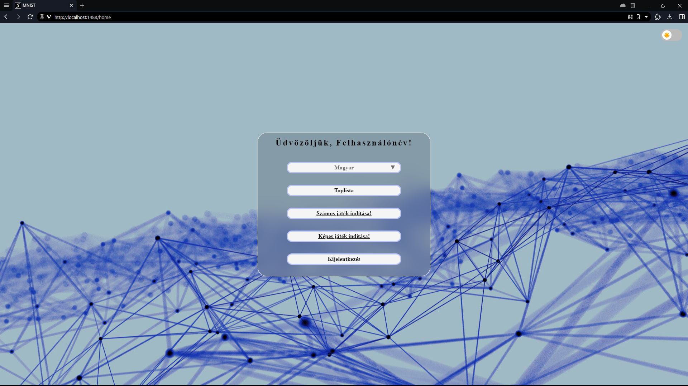
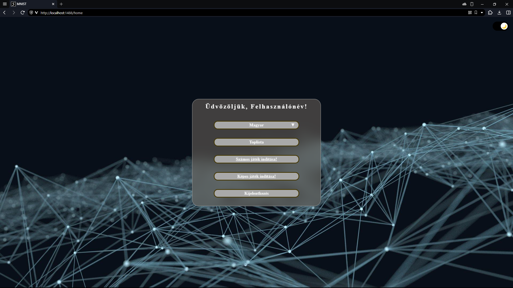
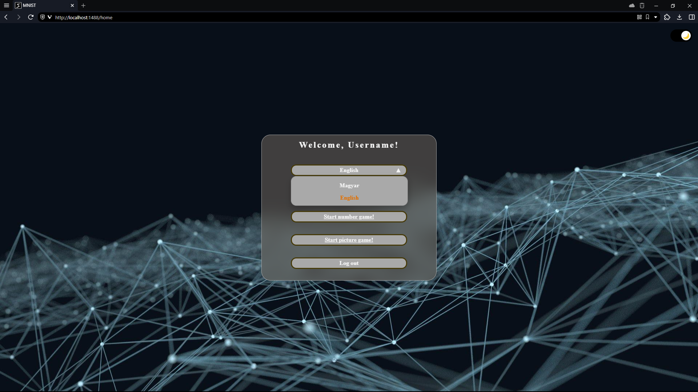
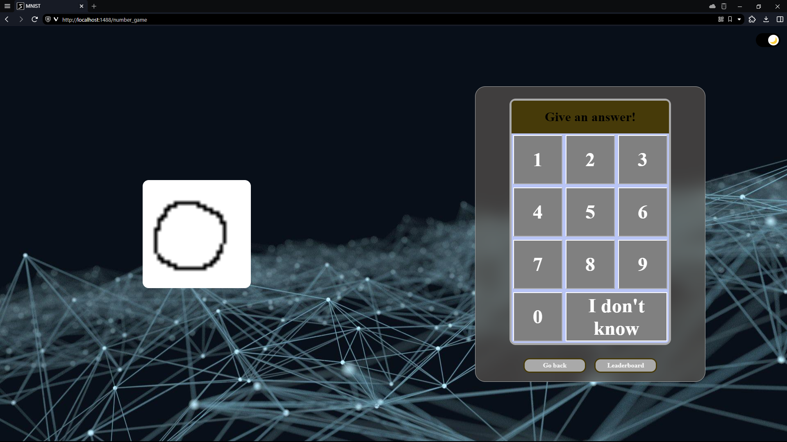
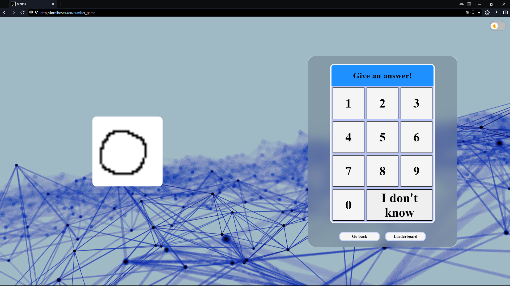

<head>
    <h1>Tesztelés</h1>
    

</head>
<body>
    <h2>Lépések:</h2>
    <table>
        <thead>
            <tr>
                <td>ID.</td>
                <td>Típus</td>
                <td>Dátum</td>
                <td>Leírás</td>
                <td>Eredmény</td>
            </tr>
        </thead>
        <tbody>
            <tr>
                <td>1.</td>
                <td>Frontend teszt</td>
                <td>2023.11.26</td>
                <td>Gombok és effektjeik tesztelése a bejelentkezési oldalon.</td>
                <td>Siker</td>
            </tr>
            <tr>
                <td>2.</td>
                <td>Frontend teszt</td>
                <td>2023.11.26</td>
                <td>Sötét téma tesztelése.</td>
                <td>Siker</td>
            </tr>
            <tr>
                <td>3.</td>
                <td>Frontend teszt</td>
                <td>2023.11.26</td>
                <td>Nyelvválasztás tesztelése.</td>
                <td>Siker</td>
            </tr>
            <tr>
                <td>4.</td>
                <td>Frontend teszt</td>
                <td>2023.11.26</td>
                <td>Regisztrációs oldalra navigálás.</td>
                <td>Siker</td>
            </tr>
            <tr>
                <td>5.</td>
                <td>Frontend teszt</td>
                <td>2023.11.26</td>
                <td>Sötét mód és nyelv választás megőrzése oldal váltásánál. (Regisztráció)</td>
                <td>Siker</td>
            </tr>
            <tr>
                <td>6.</td>
                <td>Frontend teszt</td>
                <td>2023.11.26</td>
                <td>Regisztrációs oldalon a mezők tesztelése, hogy elfogadja-e a megadott értéket.</td>
                <td>Siker</td>
            </tr>
            <tr>
                <td>7.</td>
                <td>Frontend teszt</td>
                <td>2023.11.26</td>
                <td>Helyes adatok megadása esetén a regisztráció elküldése a backend számára.</td>
                <td>Siker</td>
            </tr>
            <tr>
                <td>8.</td>
                <td>Frontend teszt</td>
                <td>2023.11.26</td>
                <td>Bejelentkezési oldalon bejelentkezés megtagadása nem regisztrált adatokkal.</td>
                <td>Siker</td>
            </tr>
            <tr>
                <td>9.</td>
                <td>Frontend teszt</td>
                <td>2023.11.26</td>
                <td>Bejelentkezési oldalon bejelentkezés engedélyezése regisztrált adatokkal.</td>
                <td>Siker</td>
            </tr>
            <tr>
                <td>10.</td>
                <td>Frontend teszt</td>
                <td>2023.11.26</td>
                <td>Bejelentkezési oldalon bejelentkezés vendég profillal, az ennek szánt gomb használatával.</td>
                <td>Siker</td>
            </tr>
            <tr>
                <td>11.</td>
                <td>Frontend teszt</td>
                <td>2023.11.26</td>
                <td>Sötét mód és nyelv választás megőrzése oldal váltásánál. (Vendég és Bejelentkezés)</td>
                <td>Siker</td>
            </tr>
            <tr>
                <td>12.</td>
                <td>Frontend teszt</td>
                <td>2023.11.26</td>
                <td>Nyelv és sötét mód váltásának tesztelése a főképernyőn, bejelentkezés után.</td>
                <td>Siker</td>
            </tr>
            <tr>
                <td>13.</td>
                <td>Frontend teszt</td>
                <td>2023.11.26</td>
                <td>Gombok tesztelése a főképernyőn.</td>
                <td>Siker</td>
            </tr>
            <tr>
                <td>14.</td>
                <td>Frontend teszt</td>
                <td>2023.11.26</td>
                <td>Téma és nyelv megőrzése a Ranglistára váltáskor.</td>
                <td>Siker</td>
            </tr>
            <tr>
                <td>15.</td>
                <td>Frontend teszt</td>
                <td>2023.11.26</td>
                <td>Téma váltás tesztelése a Ranglista oldalon.</td>
                <td>Siker</td>
            </tr>
            <tr>
                <td>16.</td>
                <td>Frontend teszt</td>
                <td>2023.11.26</td>
                <td>Visszalépés gomb tesztelése a ranglista oldalon.</td>
                <td>Siker</td>
            </tr>
            <tr>
                <td>17.</td>
                <td>Frontend teszt</td>
                <td>2023.11.26</td>
                <td>Téma és nyelv megőrzése számjáték indításakor.</td>
                <td>Siker</td>
            </tr>
            <tr>
                <td>18.</td>
                <td>Frontend teszt</td>
                <td>2023.11.26</td>
                <td>Téma gomb tesztelése a számjáték oldalon.</td>
                <td>Siker</td>
            </tr>
            <tr>
                <td>19.</td>
                <td>Frontend teszt</td>
                <td>2023.11.26</td>
                <td>Számgombok tesztelése a számjáték oldalon egérrel és billentyűzettel.</td>
                <td>Siker</td>
            </tr>
            <tr>
                <td>20.</td>
                <td>Frontend teszt</td>
                <td>2023.11.26</td>
                <td>Új kép megjelenik-e a számjáték oldalon gombnyomás után?</td>
                <td>Siker</td>
            </tr>
            <tr>
                <td>21.</td>
                <td>Frontend teszt</td>
                <td>2023.11.26</td>
                <td>Visszalépés gomb tesztelése a számjáték oldalon.</td>
                <td>Siker</td>
            </tr>
            <tr>
                <td>22.</td>
                <td>Frontend teszt</td>
                <td>2023.11.26</td>
                <td>Téma és nyelv megőrzése képjáték indításakor.</td>
                <td>Siker</td>
            </tr>
            <tr>
                <td>23.</td>
                <td>Frontend teszt</td>
                <td>2023.11.26</td>
                <td>Téma gomb tesztelése a képjáték oldalon.</td>
                <td>Siker</td>
            </tr>
            <tr>
                <td>24.</td>
                <td>Frontend teszt</td>
                <td>2023.11.26</td>
                <td>Számgombok tesztelése a képjáték oldalon egérrel és billentyűzettel.</td>
                <td>Siker</td>
            </tr>
            <tr>
                <td>25.</td>
                <td>Frontend teszt</td>
                <td>2023.11.26</td>
                <td>Új kép megjelenik-e a képjáték oldalon gombnyomás után?</td>
                <td>Siker</td>
            </tr>
            <tr>
                <td>26.</td>
                <td>Frontend teszt</td>
                <td>2023.11.26</td>
                <td>Visszalépés gomb tesztelése a képjáték oldalon.</td>
                <td>Siker</td>
            </tr>
            <tr>
                <td>27.</td>
                <td>Frontend teszt</td>
                <td>2023.11.26</td>
                <td>Kijelentkezés gomb tesztelése a főoldalon.</td>
                <td>Siker</td>
            </tr>
        </tbody>
    </table>
    

    <h2>Képek a lépésekhez:</h2>
    <h2><li>1-10. ID.:</li></h2>
    
    
    
    
    
    
    
    <h2><li>11-27. ID.:</li></h2>
    
    
    
    
    
</body>