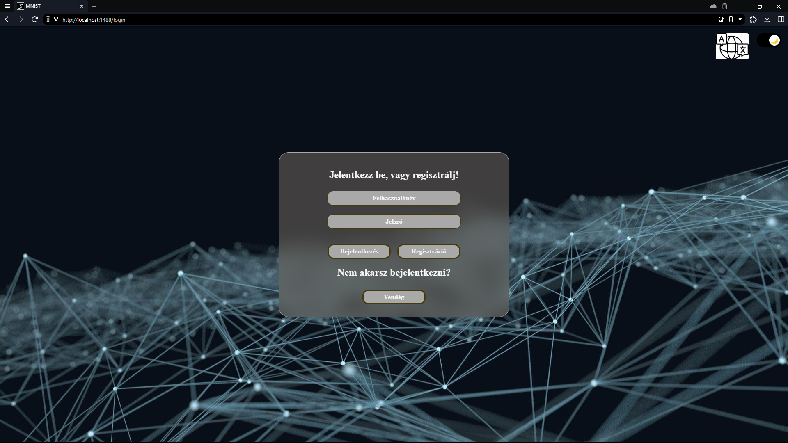
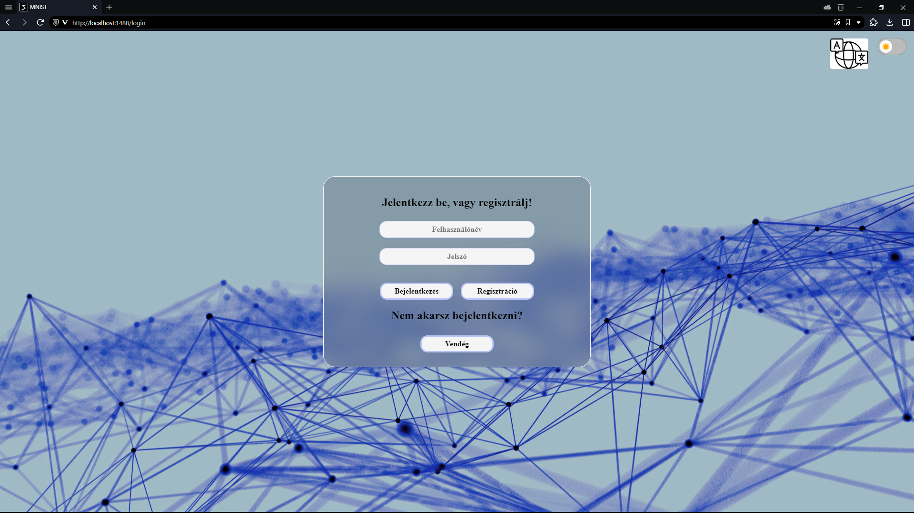
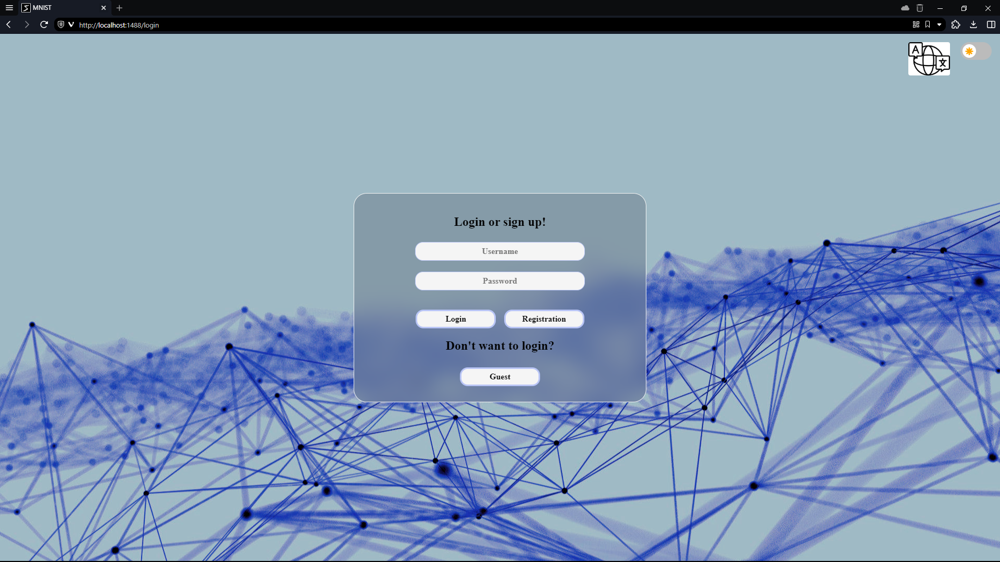
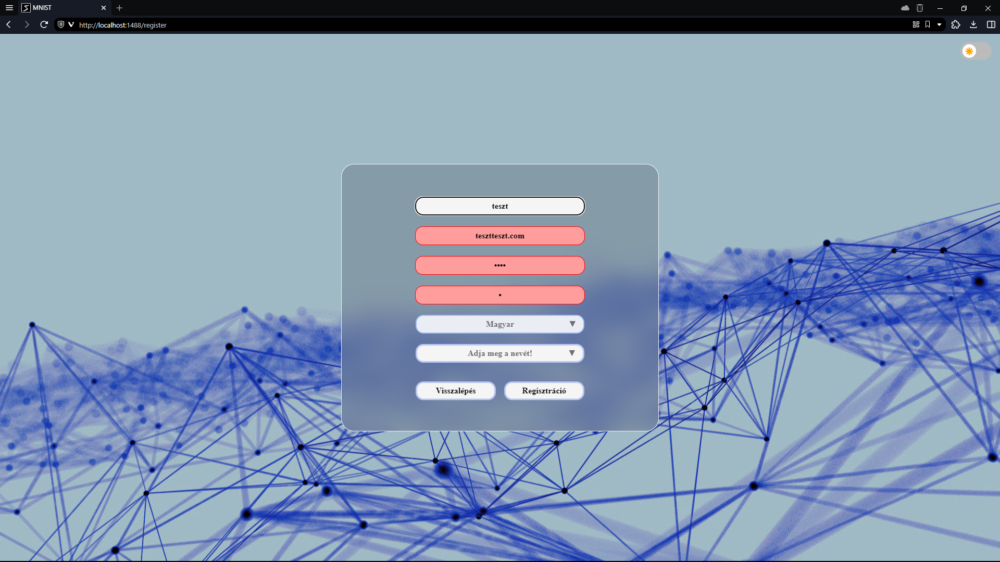
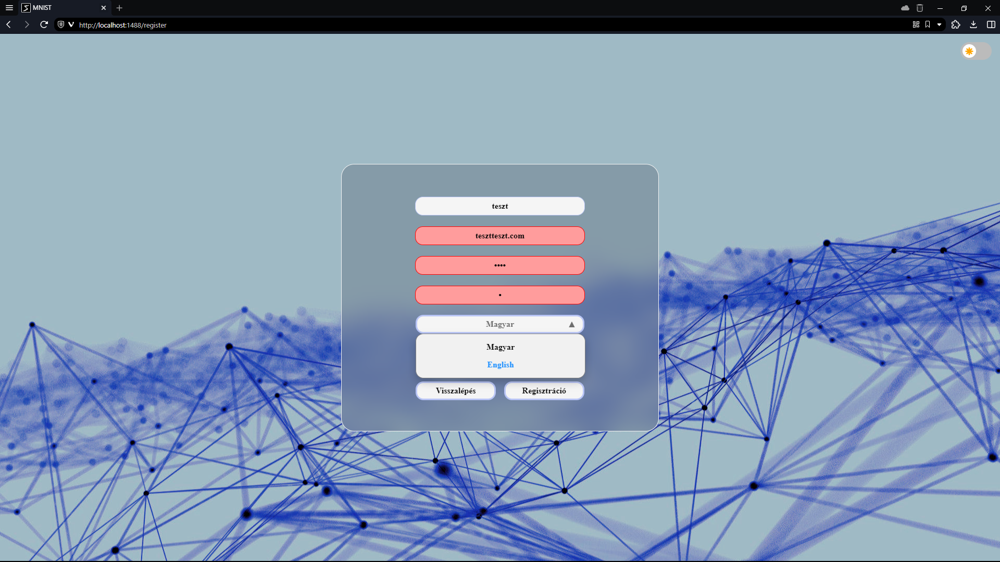
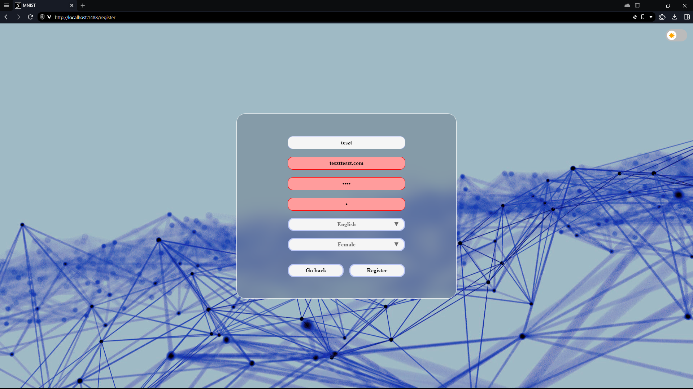
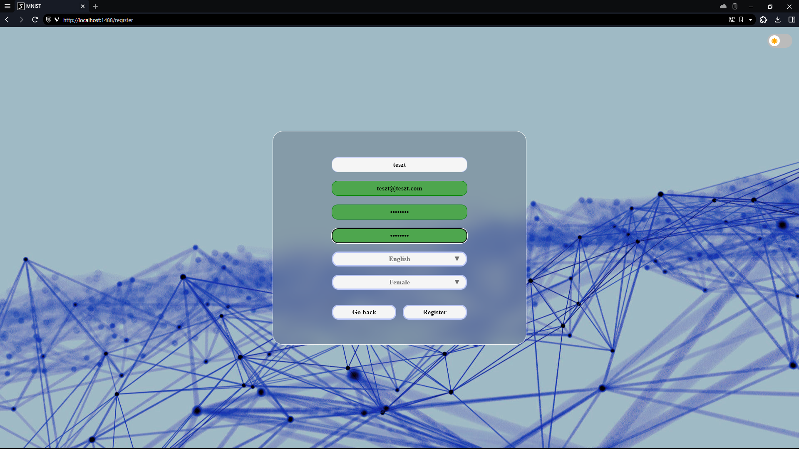

<title>Tesztelés</title>
<head>
    <h1>Tesztelés</h1>
    

</head>
<body>
    <h2>Lépések:</h2>
    <table>
        <thead>
            <tr>
                <td>ID.</td>
                <td>Típus</td>
                <td>Dátum</td>
                <td>Leírás</td>
                <td>Eredmény</td>
            </tr>
        </thead>
        <tbody>
            <tr>
                <td>1.</td>
                <td>Frontend teszt</td>
                <td>2023.11.26</td>
                <td>Gombok és effektjeik tesztelése a bejelentkezési oldalon.</td>
                <td>Siker</td>
            </tr>
            <tr>
                <td>2.</td>
                <td>Frontend teszt</td>
                <td>2023.11.26</td>
                <td>Sötét téma tesztelése.</td>
                <td>Siker</td>
            </tr>
            <tr>
                <td>3.</td>
                <td>Frontend teszt</td>
                <td>2023.11.26</td>
                <td>Nyelvválasztás tesztelése.</td>
                <td>Siker</td>
            </tr>
            <tr>
                <td>4.</td>
                <td>Frontend teszt</td>
                <td>2023.11.26</td>
                <td>Regisztrációs oldalra navigálás.</td>
                <td>Siker</td>
            </tr>
            <tr>
                <td>5.</td>
                <td>Frontend teszt</td>
                <td>2023.11.26</td>
                <td>Sötét mód és nyelv választás megőrzése oldal váltásánál.</td>
                <td>Siker</td>
            </tr>
            <tr>
                <td>6.</td>
                <td>Frontend teszt</td>
                <td>2023.11.26</td>
                <td>Regisztrációs oldalon a mezők tesztelése, hogy elfogadja-e a megadott értéket.</td>
                <td>Siker</td>
            </tr>
            <tr>
                <td>7.</td>
                <td>Frontend teszt</td>
                <td>2023.11.26</td>
                <td>Helyes adatok megadása esetén a regisztráció elküldése a backend számára.</td>
                <td>Siker</td>
            </tr>
            <tr>
                <td>8.</td>
                <td>Frontend teszt</td>
                <td>2023.11.26</td>
                <td>Bejelentkezési oldalon bejelentkezés megtagadása nem regisztrált adatokkal.</td>
                <td>Siker</td>
            </tr>
            <tr>
                <td>9.</td>
                <td>Frontend teszt</td>
                <td>2023.11.26</td>
                <td>Bejelentkezési oldalon bejelentkezés engedélyezése regisztrált adatokkal.</td>
                <td>Siker</td>
            </tr>
            <tr>
                <td>10.</td>
                <td>Frontend teszt</td>
                <td>2023.11.26</td>
                <td>Bejelentkezési oldalon bejelentkezés vendég profillal, az ennek szánt gomb használatával.</td>
                <td>Siker</td>
            </tr>
        </tbody>
    </table>
    

    <h2>Képek a lépésekhez:</h2>
    <h2><li>1-10. ID.:</li></h2>
    
    
    
    
    
    
    
    <h2><li>11-20. ID.:</li></h2>
</body>