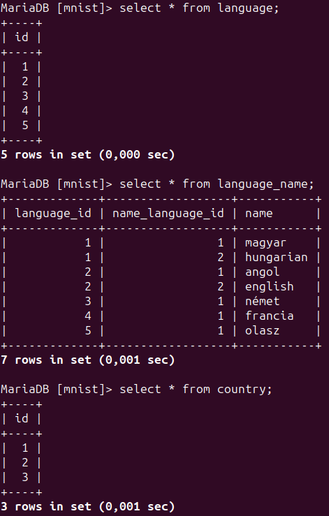
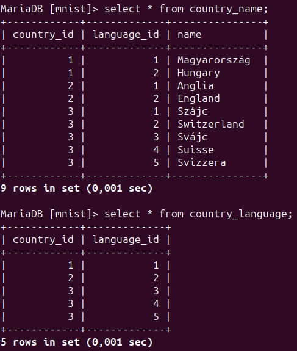
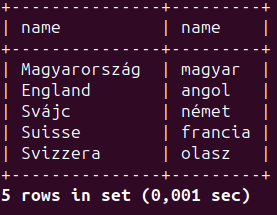
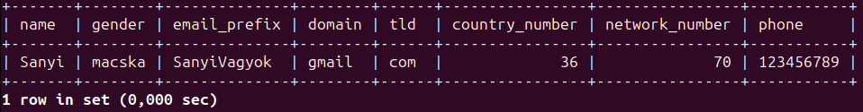

| id  | type        | date       | description                                                                              | result  |
|----:|------------:|------------|:-----------------------------------------------------------------------------------------|:--------|
| 1   | Adatbázis   | 2023-10-11 | Magyar és angol nyelv hozzáadása az ismert nyelvekhez                                    | Success |
| 2   | Adatbázis   | 2023-10-11 | Magyarország és Anglia hozzáadása az ismert nyelveken az országokhoz                     | Success |
| 3   | Adatbázis   | 2023-10-11 | Ismert országok nevének lekérdezése a saját nyelvükön, használt nyelvük kiírása magyarul | Success |
| 4   | Adatbázis   | 2023-10-11 | Svájc hozzáadása 3 hivatalos nyelvével (német, francia, olasz)                           | Success |
| 5   | Adatbázis   | 2023-10-11 | Ellenőrzés, hogy nem okoz gondot, ha 1 nyelv nevét csak 1 nyelven tárolom                | Success |
| 5   | Adatbázis   | 2023-10-11 | Ha a német nyelv megnevezés csak magyarul van tárolva, használhatok német szavakat       | Success |
| 6   | Adatbázis   | 2023-10-11 | 3. teszt ismétlése a többnyelvű Svájccal is                                              | Success |
| 7   | Adatbázis   | 2023-10-11 | Nem enged kamu nyelvazonosítóval beszúrni playert                                        | Success |
| 8   | Adatbázis   | 2023-10-11 | Nem enged kamu országazonosítóval beszúrni playert                                       | Success |
| 9   | Adatbázis   | 2023-10-11 | Nem enged kamu nemazonosítóval beszúrni playert                                          | Success |
| 10  | Adatbázis   | 2023-10-11 | Nem enged kamu e-mail domain-nel beszúrni playert                                        | Success |
| 11  | Adatbázis   | 2023-10-11 | Nem enged kamu e-mailt beszúrni a playerhez, ha nincs domain hozzá                       | Success |
| 12  | Adatbázis   | 2023-10-11 | Nem enged nem számokat használni telefonszámban                                          | Success |
| 13  | Adatbázis   | 2023-10-11 | Nem enged országhívó kód nélkül telefonszámot megadni                                    | Success |
| 14  | Adatbázis   | 2023-10-11 | Nem enged kamu országhívó kódot megadni                                                  | Success |
| 15  | Adatbázis   | 2023-10-11 | Nem enged hálózati-szolgáltató kód nélkül telefonszámot megadni                          | Success |
| 16  | Adatbázis   | 2023-10-11 | Nem enged nem telefonszám alapú telefonszámot megadni                                    | Success |
| 17  | Adatbázis   | 2023-10-11 | Nem enged nem adatbázisban előre letárolt jelszót használni                              | Success |
| 18  | Adatbázis   | 2023-10-11 | Adatbázisba olyan rekordok felvétele, amikkel már tud rendelkezni egy felhasználó        | Success |
| 19  | Adatbázis   | 2023-10-12 | Egy regisztrált játékos tényleges, teljes regisztrációja                                 | Success |
| 20  | Adatbázis   | 2023-10-12 | Egy kép beszűrása az adatbázisba                                                         | Success |
| 21  | Log         | 2023-10-13 | Egy player bejelentkezésének regisztrálása                                               | Success |
| 22  | Adatbázis   | 2023-10-13 | Egy képformátum regisztrálása az adatbázisba                                             | Success |
| 23  | Adatbázis   | 2023-10-13 | Egy kép fragmentálásának elhelyezése az adatbázisban                                     | Success |
| 24  | Merevlemez  | 2023-10-13 | Egy kép-fragment rekordja 255 - néhány byte, a hatékony keresés és tárolás miatt         | Success |
| 25  | Szerver     | 2023-10-17 | A szerver elindítása általános függőségmegadással                                        | Success |
| 26  | Szerver     | 2023-10-19 | A szerver és a client tud kommunikálni egymással publikus hálón keresztül.               | Success |
| 27  | Szerver     | 2023-10-19 | Sikeres szerver oldali bejelentkezés fiktív adatokkal                                    | Success |
## Egyszerűbb áttekinthetőségért csak a nehezebb lekérdezéseket írtam le, triviálisakat kevésbé.

(Pl.: Nem írom le, hogy hogyan szúrunk be a táblába egy sort, mert 1 perc google, és nem akarom, hogy 100 oldal legyen a dokumentum.)

### Test 1-6





(Bár Svájcban a rétoromán is hivatalos nyelv, háttérbe szorul, ezért nem vettem bele.
Hozzáadtam a 3 hivatalos nyelvén is az ország adatait.)

A nyelvek között most a németet, franciát és olaszt úgy tárolom el, hogy csak magyarul tárolom el a nevét, hogy mi az.
(Ugye ID-k vannak csak, ezért nem sérül meg az adatbázis és konzisztens marad.)
Így tudok német nyelvet használni úgy, hogy magát a nyelvet nem nevezem mondjuk Deutch-nak.

Most, hogy letároltam 5 nyelven Svájcot, így a 3. tesztben most 3-szor kéne szerepelnie Svájcnak, mert mindhárom hivatalos nyelv.
(A lekérdezés a 3. tesztben kimásolható.)

```sql
select country_name.name, language_name.name
from country_name
inner join language
    on country_name.language_id = language.id
inner join language_name
	on country_name.language_id = language.id and
	language_name.language_id = language.id
inner join country
	on country.id = country_name.country_id
inner join country_language
	on country_language.country_id = country.id and
	country_language.language_id = language.id
where
	language_name.name_language_id =
	(select id from language
		inner join language_name
			on language.id = language_name.language_id and
			language_name.name_language_id = language.id
		where
			language_name.language_id = language_name.name_language_id and
			language_name.name = "magyar");
```



## Test 7-19

Itt a userre vonatkozó adatbázis integritását és sérthetetlenségét tesztelem, hogy minden információ, ami benne van, garantáltan valódi, ne lehessen hamis adatokat megadni. Az adatbázis a kulcsmegszorítások miatt minden ilyen kérést meg kell, hogy tagadjon akkor is, ha a fentebbi kódréteg ezt nem veszi észre, így többrétegű a biztonság is.
Ez nem azt jelenti, hogy eddig nem létező országgal nem szúrhatunk be soha semmilyen körülmények között új playert, de ehhez először az adott országot fel kell venni a nyílvántartásba automatikusan vagy manuálisan.



```sql
select registered_player.name as name, gender_name.name as gender,
registered_player.email_prefix, email_type.domain, email_tld.tld,
country_calling_code.country_number, phone_network.network_number,
phone
from registered_player, gender, gender_name, email_type, email_tld,
country_calling_code, phone_network
	where
		registered_player.gender_id = gender.id and
		gender_name.gender_id = gender.id and
		email_type.tld_id = email_tld.id and
		registered_player.email_type_id = email_type.id and
		registered_player.country_calling_code_id = country_calling_code.id and
		registered_player.phone_network_id = phone_network.id and
		gender_name.language_id =
		(select id from language
			inner join language_name
				on language.id = language_name.language_id and
				language_name.name_language_id = language.id
			where
				language_name.language_id = language_name.name_language_id and
				language_name.name = "magyar");
```

## Teszt 27

A curl parancs az alábbi volt:

```bash
curl -X POST -H "Content-Type: application/json" -d '{"username": "felhasznalonev", "password": "jelszo"}' http://localhost:8814/login/
```
