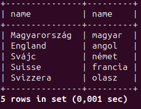

| id  | type        | date       | description                                                                              | result  |
|----:|------------:|------------|:-----------------------------------------------------------------------------------------|:--------|
| 1   | Adatbázis   | 2023-10-11 | Magyar és angol nyelv hozzáadása az ismert nyelvekhez                                    | Success |
| 2   | Adatbázis   | 2023-10-11 | Magyarország és Anglia hozzáadása az ismert nyelveken az országokhoz                     | Success |
| 3   | Adatbázis   | 2023-10-11 | Ismert országok nevének lekérdezése a saját nyelvükön, használt nyelvük kiírása magyarul | Success |
| 4   | Adatbázis   | 2023-10-11 | Svájc hozzáadása 3 hivatalos nyelvével (német, francia, olasz)                           | Success |
| 5   | Adatbázis   | 2023-10-11 | Ellenőrzés, hogy nem okoz gondot, ha 1 nyelv nevét csak 1 nyelven tárolom                | Success |
| 5   | Adatbázis   | 2023-10-11 | Ha a német nyelv megnevezés csak magyarul van tárolva, használhatok német szavakat       | Success |
| 6   | Adatbázis   | 2023-10-11 | 3. teszt ismétlése a többnyelvű Svájccal is                                              | Success |

## Egyszerűbb áttekinthetőségért csak a nehezebb lekérdezéseket írtam le, triviálisakat kevésbé.

(Pl.: Nem írom le, hogy hogyan szúrunk be a táblába egy sort, mert 1 perc google, és nem akarom, hogy 100 oldal legyen a dokumentum.)

### Test 1-6


(Bár Svájcban a rétoromán is hivatalos nyelv, háttérbe szorul, ezért nem vettem bele.
Hozzáadtam a 3 hivatalos nyelvén is az ország adatait.)

A nyelvek között most a németet, franciát és olaszt úgy tárolom el, hogy csak magyarul tárolom el a nevét, hogy mi az.
(Ugye ID-k vannak csak, ezért nem sérül meg az adatbázis és konzisztens marad.)
Így tudok német nyelvet használni úgy, hogy magát a nyelvet nem nevezem mondjuk Deutch-nak.

Most, hogy letároltam 5 nyelven Svájcot, így a 3. tesztben most 3-szor kéne szerepelnie Svájcnak, mert mindhárom hivatalos nyelv.
(A lekérdezés a 3. tesztben kimásolható.)

```sql
select country_name.name, language_name.name
from country_name
inner join language
    on country_name.language_id = language.id
inner join language_name
	on country_name.language_id = language.id and
	language_name.language_id = language.id
inner join country
	on country.id = country_name.country_id
inner join country_language
	on country_language.country_id = country.id and
	country_language.language_id = language.id
where
	language_name.name_language_id =
	(select id from language
		inner join language_name
			on language.id = language_name.language_id and
			language_name.name_language_id = language.id
		where
			language_name.language_id = language_name.name_language_id and
			language_name.name = "magyar");
```


