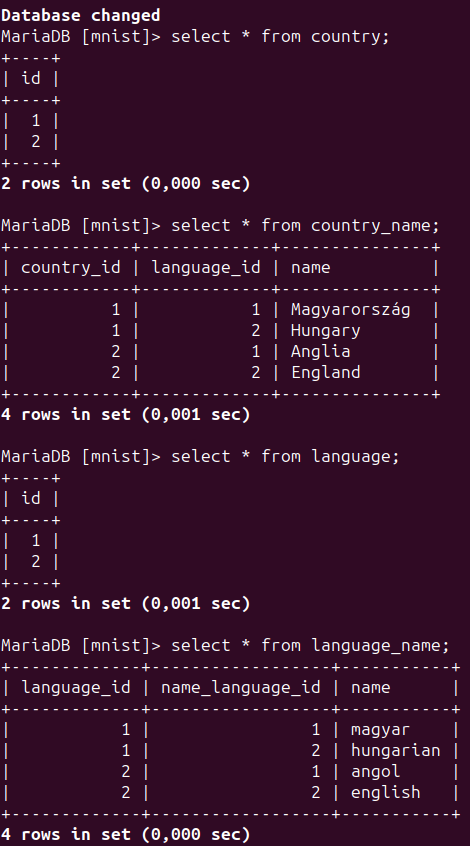
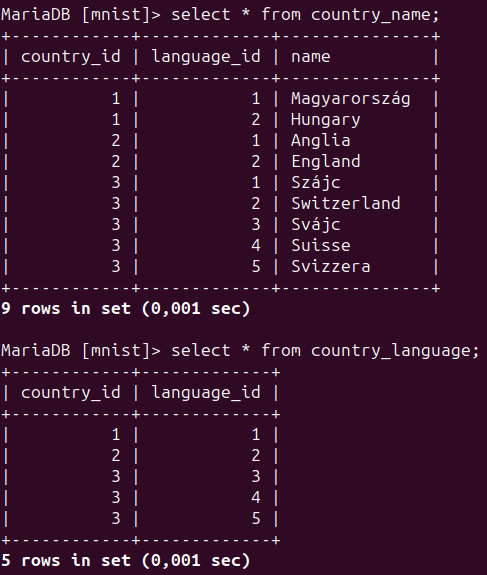

| id  | type        | description                                                          | result  |
|----:|------------:|:---------------------------------------------------------------------|:--------|
| 1   | Adatbázis   | Magyar és angol nyelv hozzáadása az ismert nyelvekhez                | Success |
| 2   | Adatbázis   | Magyarország és Anglia hozzáadása az ismert nyelveken az országokhoz | Success |
| 3   | Adatbázis   | Ismert országok nevének lekérdezése a saját nyelvükön                | Success |


### Test 1-3





```sql
select country_name.name, language_name.name
from country_name
inner join language
    on country_name.language_id = language.id
inner join language_name
	on country_name.language_id = language.id and
	language_name.language_id = language.id
where language_name.language_id = language_name.name_language_id;
```
